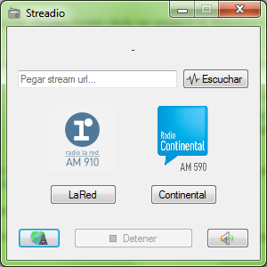
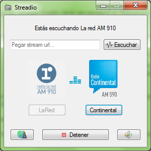
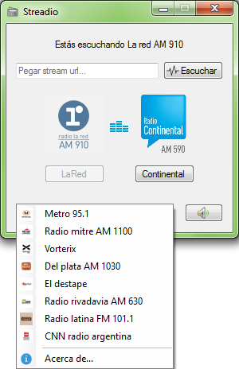
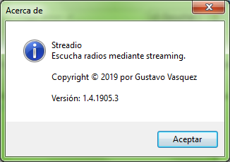

# Proyecto_SubtitleFinder
Aplicación winforms para buscar subtítulos de series y películas usando como fuente sitios web utilizando web scraping.

Ventana principal
:-------------------------:

Al abrir el programa te vas a encontrar con dos radios principales, control de volumen y la posibilidad de reproducir cualquier radio mediante la url.

Reproduciendo
:-------------------------:

Además de las dos radios principales, se pueden reproducir ocho radios adicionales (también disponibles desde la jumplist de Windows).

Radios disponibles
:-------------------------:

Información del programa
:-------------------------:

## Notas
Este programa fue hecho usando ASP.NET Winforms C#

## Autor
Gustavo Vasquez
